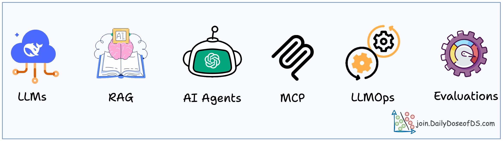

  

---

# AI Engineering Hub 🚀
Welcome to the **AI Engineering Hub**!

## 🌟 Why This Repo?

AI Engineering is advancing rapidly, and staying at the forefront requires both deep understanding and hands-on experience. In this repo you'll find 70+ hands-on tutorials on MCP, RAG and AI Angets with full code implementation.

---
## 📬 Stay Updated with Our Newsletter!

---

## 📢 Contribute to the AI Engineering Hub!
We welcome contributors! Whether you want to add new tutorials, improve existing code, or report issues, your contributions make this community thrive. Here’s how to get involved:
1. **Fork** the repository.
2. Create a new branch for your contribution.
3. Submit a **Pull Request** and describe the improvements.

---

## 📜 License
This repository is licensed under the MIT License - see the [LICENSE](LICENSE) file for details.

## 💬 Connect
For discussions, suggestions, and more, feel free to [create an issue](https://github.com/patchy631/ai-engineering/issues) or reach out directly!

Happy Coding! 🎉
