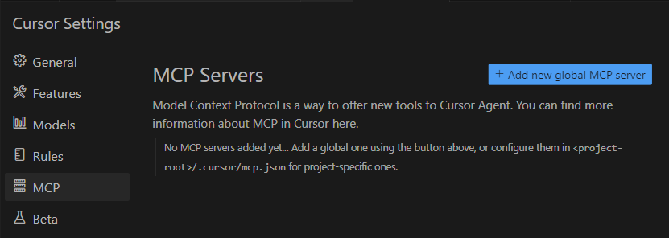
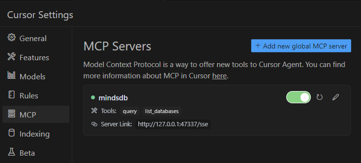

# 🧠 Unified MCP Server with MindsDB

[](https://mindsdb.com/)
[](https://www.docker.com/)
[](https://opensource.org/licenses/MIT)

This project builds a unified MCP server to query and chat with all your data sources 
using natural language through a unified interface powered by [MindsDB](https://github.com/mindsdb/mindsdb) and Cursor IDE.

MindsDB's federated query engine can:
- Understand complex questions in the context of organizations' data
- Retrieve knowledge across structured and unstructured data platforms
- Deliver actionable insights by translating retrieved data into predictions and recommendations
- Provide transparency into its thinking process with detailed reasoning logs
- Ensure data privacy by operating within secure, private environments

## 📚 Table of Contents
- [Overview](#-project-overview)
- [Features](#-key-features)
- [How It Works](#️-how-it-works)
- [Installation](#️-installation)
- [Data Sources Integration](#-integrate-data-sources)
  - [Slack](#-slack)
  - [Gmail](#-gmail)
  - [GitHub](#-github)
  - [Hacker News](#-hacker-news)
- [MCP Server Integration](#-mcp-server--cursor-integration)
- [Resources](#-stay-updated-with-our-newsletter)
- [Contribute](#contribution)

## 🧭 Project Overview

The **Unified MCP Server** is a powerful solution that enables seamless federated queries 
across multiple data sources through natural language. By combining MindsDB's federated query 
capabilities with Cursor IDE's interface, users can interact with their data using simple 
conversational queries in one place.

### 🔑 Key Features
- 🔍 Query multiple data sources with a single prompt
- 🧠 Context-aware AI answers tailored to your connected data
- 💬 Real-time chat interface using Cursor IDE
- 🔧 Modular design to easily add more data sources
- 🐳 Easy Docker-based deployment

### ⚙️ How It Works

- User submits a query to Cursor Agent.
- The client sends user query to the MCP server.
- The MCP server sends the query to the federated query engine.
- The federated query engine computes and returns the results to the MCP server.
- The MCP server returns the results to the client via the host (Cursor).
- The AI Agent synthesizes a response based on the retrieved information/results.
- User gets back the generated response.

## 🛠️ Installation

Before installation, ensure you have the following installed and running:
- Docker
- Cursor IDE

### Install MindsDB
Run this command to create a Docker container with MindsDB:

```bash
docker run --name mindsdb_container -e MINDSDB_APIS="http,mcp" \
-p 47334:47334 -p 47337:47337 mindsdb/mindsdb
```

Now you can access the MindsDB editor by going to `127.0.0.1:47334` in your browser.


### 📦 Setting Up Dependencies

Start the Docker container you created above:
```bash
docker start mindsdb_container
```

Start an interactive shell in the container:
```bash
docker exec -it mindsdb_container sh
```

In the shell, run the following commands to install dependencies for Gmail, Slack and GitHub handlers:
```bash
pip install .[gmail]
pip install .[slack]
pip install .[github]
```

Exit the interactive shell:
```bash
exit
```

Restart the container:
```bash
docker restart mindsdb_container
```

## 🔌 Integrate Data Sources

### 🔗 Slack

#### Setup a Slack app

1. Go to https://api.slack.com/apps and sign in with your Slack account.

2. Create a new app `From scratch`.

3. Go to `Basic Information` under `Settings`.

    - Under `App-Level Tokens`, click on `Generate Token and Scopes`.

    - Name the token `socket` and add the `connections:write` scope.

    - Copy and save the `xapp-...` token - you'll need it to publish the chatbot.

4. Go to `Socket Mode` under `Settings` and toggle the button to `Enable Socket Mode`.

5. Go to `OAuth & Permissions` under `Features`.

   - Add the following *Bot Token Scopes*:

     - `app_mentions:read`
     - `channels:history`
     - `channels:read`
     - `chat:write`
     - `groups:history`
     - `groups:read` *(optional)*
     - `im:history`
     - `im:read`
     - `im:write`
     - `mpim:read` *(optional)*
     - `users.profile:read`
     - `users:read` *(optional)*

   - In the `OAuth Tokens for Your Workspace` section, click on `Install to Workspace` and then `Allow`.

   - Copy and save the `xoxb-...` token - you'll need it to publish the chatbot.

6. Go to `App Home` under `Features` and click on the checkbox to `Allow users to send Slash commands and messages from the messages tab`.

7. Go to `Event Subscriptions` under `Features`.

    - Toggle the button to `Enable Events`.

    - Under `Subscribe to bot events`, click on `Add Bot User Event` and add `app_mention` and `message.im`.

    - Click on `Save Changes`.

8. You can now connect your app to the Slack channel:

    - Go to the channel where you want to use the bot.

    - Right-click on the channel and select `View Channel Details`.

    - Select `Integrations`.
    
    - Click on `Add an App`.

#### Create Database

After these steps are done, you can use tokens generated from points 3 and 5 to initialize 
the Slack handler in MindsDB.

To connect your data sources with MindsDB, go to the MindsDB editor running locally at `127.0.0.1:47334` and run the following command to integrate Slack:
```SQL
CREATE DATABASE mindsdb_slack
WITH ENGINE = 'slack',
PARAMETERS = {
  "token": "xoxb-...",
  "app_token": "xapp-..."
};
```

### 📧 Gmail

#### Setup Gmail API

1. Create a Google Cloud Platform (GCP) Project:

    - Go to the [GCP Console](https://console.cloud.google.com/).

    - Create a new project.

    - Give your new project a name.

    - Click `Create` to create the new project.

2. Enable the Gmail API:

    - In the GCP Console, select your project.

    - Navigate to `APIs & Services` > `Library`.

    - In the search bar, search for `Gmail`.

    - Click on `Gmail API`, then click `Enable`.

3. Create credentials for the Gmail API:

    - Navigate to `APIs & Services` > `Credentials`.

    - Click on the `Create Credentials` button and choose `OAuth client ID`.

    - If you haven't configured the OAuth consent screen before, you'll be prompted to do so now. 
    Make sure to choose `External` for `User Type`, and select the necessary scopes. 
    Make sure to save the changes.

    - Now, create the OAuth client ID. Choose `Web application` for the `Application Type` and give it a name.

    - Add the following MindsDB URL to `Authorized redirect URIs`:

        - For local installation, add http://localhost/verify-auth
        - For Cloud, add http://cloud.mindsdb.com/verify-auth.
    
    - Click `Create`.

4. Download the JSON file:

    - After creating your credentials, click the download button (an icon of an arrow pointing down) on the right side of your client ID. This will download a JSON file, so you will use the location to it in the `credentials_file` param.

5. Add user authentication:

    - Navigate to `APIs & Services` > `OAuth consent screen` > `Audience`.

    - Under `Test users` add your Google account and save.

#### Create Database

Go to the MindsDB editor running locally at `127.0.0.1:47334` and run the following command to integrate Gmail:
```SQL
CREATE DATABASE mindsdb_gmail
WITH ENGINE = 'gmail',
PARAMETERS = {
  "credentials_file": "path/to/credentials.json",
  "scopes": ['https://.../gmail.compose', 'https://.../gmail.readonly']
};
```

When prompted, sign in with the Google account you added to the `Test users` in your app and you are good to go.

### 🐙 GitHub

#### Generate API key

1. In your GitHub profile go to `Settings`.

2. In the left sidebar, click `<> Developer settings`.

3. In the left sidebar, under  `Personal access tokens`, click `Fine-grained tokens`.

4. Click `Generate new token`.

5. Under `Token name`, enter a name for the token.

6. Click `Generate token`.

#### Create Database

Go to the MindsDB editor running locally at `127.0.0.1:47334` and run the following command to integrate GitHub:
```SQL
CREATE DATABASE mindsdb_github
WITH ENGINE = 'github',
PARAMETERS = {
  "repository": "username/repo",
  "api_key": <YOUR_PERSONAL_ACCESS_TOKEN>
};
```

### 🚀 Hacker News

No authentication is required for Hacker News.

#### Create Database

Go to the MindsDB editor running locally at `127.0.0.1:47334` and run the following command to integrate Hacker News:
```SQL
CREATE DATABASE mindsdb_hackernews
WITH ENGINE = 'hackernews';
```

## 🧠 MCP Server + Cursor Integration

Follow these steps to integrate MindsDB MCP server with Cursor:

1. Open Cursor and go to: `File` → `Preferences` → `Cursor Settings` → `MCP` → `Add new global MCP server`



2. To the `mcp.json` file add:
```json
{
    "mcpServers": {
        "mindsdb": {
            "url": "http://127.0.0.1:47337/sse"
        } 
    }
}
```

3. Ensure that MindsDB is listed as an MCP server and toggle the button to connect server to host.



After completing all the above steps now we are ready to chat with our data through our unified MindsDB MCP server.

Open the Cursor chat window and select the Agent mode from the dropdown.


Ask questions over your data.

{chat screenshot images}

---

## 📬 Stay Updated with Our Newsletter!
**Get a FREE Data Science eBook** 📖 with 150+ essential lessons in Data Science when you subscribe to our newsletter! Stay in the loop with the latest tutorials, insights, and exclusive resources. [Subscribe now!](https://join.dailydoseofds.com)

[](https://join.dailydoseofds.com)

---

## Contribution

Contributions are welcome! Please fork the repository and submit a pull request with your improvements.

